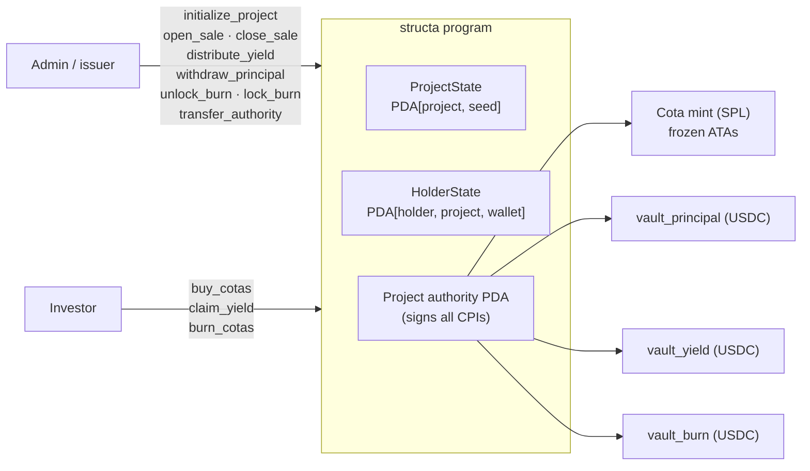

# Structa

**On-chain fundraising for Brazilian real-estate development, settled in USDC on Solana.**

[Live app](https://structa-frontend.vercel.app) · [Program on Solana devnet](https://explorer.solana.com/address/2vEvLqNyMKPx7B6nz1yaKJgNBMV7DeXv17dTYR8T5SSf?cluster=devnet) · Built at Colosseum Frontier

---

## The problem

A mid-sized Brazilian builder funds a development in one of two ways: an institutional line
from Caixa Econômica Federal (cheap, slow, collateral-heavy), or private investors buying
claims on a specific project (fast, expensive, and administratively brutal). The second path
runs on spreadsheets: who owns which claim, how much each holder is owed when units sell,
what happens when a project is cancelled.

I ran that second path for six years as co-founder of a construction company in Pernambuco
(12 concurrent projects, 100+ people). Structa moves the accounting on-chain: each
development raises USDC against a fixed number of **cotas**, distributes yield pro-rata as
units sell, and can refund principal if the project does not go ahead.

## My role

**Co-founder — product and protocol design.** I defined the thesis and the issuer/investor
flows, and designed the on-chain model: non-transferable cotas, the three-vault split
(principal / yield / burn), cumulative-per-token yield, and the burn-for-refund path.
Engineering of the program, backend and frontend was led by my co-founder
[Eduardo Manczenko](https://github.com/EduardoManczenko); those repositories are private and
available on request.

## Architecture

One Anchor program serves every development. Each project is a set of PDAs derived from a
32-byte project seed, so a new development costs account rent, not a new deploy.

| Instruction | Caller | Effect |
| --- | --- | --- |
| `initialize_project` | admin | Creates project state, cota mint and three USDC vaults |
| `open_sale` / `close_sale` | admin | Toggles the primary sale |
| `buy_cotas` | investor | Pays `amount × price` USDC into `vault_principal`; mints cotas to a frozen ATA |
| `distribute_yield` | admin | Bumps `cumulative_yield_per_token` (USDC must already be in `vault_yield`) |
| `claim_yield` | investor | Pulls `(cumulative − snapshot) × balance` from `vault_yield` |
| `withdraw_principal` | admin | Releases raised USDC to the builder |
| `unlock_burn` / `lock_burn` | admin | Moves remaining principal to `vault_burn` and opens refunds |
| `burn_cotas` | investor | Burns cotas, refunds at the original price, settles pending yield first |
| `transfer_authority` | admin | Hands the project to a new signer (e.g. a multisig) |

**Stack:** Rust · Anchor 0.31 · SPL Token · USDC · TypeScript SDK · NestJS + Supabase · Next.js 15 · Solana Wallet Adapter

## Design decisions

- **Cumulative yield per token, not loops.** `distribute_yield` is O(1): it increments a
  scaled accumulator (`1e12`). Each holder keeps a snapshot and claims the delta. Scales to
  any number of holders and lets a crank claim on a holder's behalf.
- **Non-transferable cotas via freeze authority.** The program PDA freezes every cota ATA
  right after minting and thaws only inside its own burn path. Yield accounting is keyed to
  `HolderState`, so an SPL transfer would otherwise desynchronise owner-of-record and payouts.
- **No retroactive yield.** A first-time buyer's snapshot is set to the current accumulator;
  repeat buys and burns settle pending yield *before* the balance changes.
- **Separate vaults by purpose.** Principal, yield and refunds never share a token account,
  so a yield distribution can't spend investor principal and vice versa.
- **Solvency check on distribution.** `distribute_yield` requires
  `vault_yield ≥ outstanding_unclaimed + amount`, so the accumulator never promises USDC the
  vault doesn't hold.

## Threat model

What the program defends against, and the trust assumptions that remain.

| Vector | Status |
| --- | --- |
| Unauthorised admin calls | Mitigated — every admin context uses `has_one = authority` plus seeded PDA checks |
| Vault / mint substitution | Mitigated — vaults pinned with `address = project.vault_*`, mints checked against stored keys |
| Arithmetic overflow | Mitigated — `checked_*` everywhere, `u128` intermediates, supply capped at `1e10` |
| Yield sniping (buy right before a distribution) | Mitigated — snapshot on entry, settle-before-change on buy and burn |
| Secondary-market drift of cota ownership | Mitigated — ATAs frozen; only the program thaws |
| Rounding | Accumulator truncates; dust stays in `vault_yield` (favours solvency over holders) |
| **Single-key authority** | **Open.** `withdraw_principal` can send the full principal vault to any USDC account at any time. Mitigation planned: `transfer_authority` to a Squads multisig with a timelock, and milestone-gated withdrawals |
| **Refund shortfall** | **Open.** Once principal has been withdrawn, `burn_cotas` refunds at the original price first-come-first-served; late holders can find `vault_burn` empty. Planned: pro-rata refund based on the burn-vault balance at unlock |
| **One-step authority transfer** | **Open.** A typo in `transfer_authority` bricks admin control. Planned: propose/accept two-step handover |
| Off-chain legal wrapper | Out of scope for the program — issuer KYC, the cota's legal form and registry (`matrícula`) reconciliation live off-chain |

## Status

- Program deployed on **Solana devnet** — [`2vEvLqNy…T5SSf`](https://explorer.solana.com/address/2vEvLqNyMKPx7B6nz1yaKJgNBMV7DeXv17dTYR8T5SSf?cluster=devnet)
- Full investor flow live on devnet at [structa-frontend.vercel.app](https://structa-frontend.vercel.app): wallet login, cota purchase, portfolio, yield history
- Integration test suite covers every instruction: authorisation, sale state, supply limits, arithmetic edges, multi-holder yield and the burn/refund cycle
- Next: multisig authority, pro-rata refunds, and the issuer-side legal wrapper for a first pilot

## Contact

Lucas de Almeida — [lucasalmeida.me](https://lucasalmeida.me) · lucasalb11@gmail.com · [LinkedIn](https://www.linkedin.com/in/lucasalb11/)
